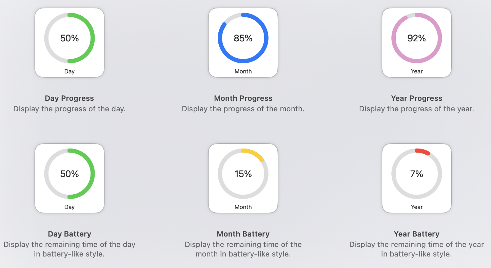
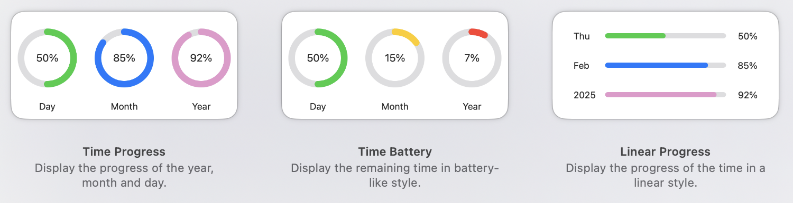

# 简体中文

在主屏幕上随时查看 **年度、月份和每日** 进度！

## 功能特点

- **自动更新**：小组件每 **15 分钟** 刷新一次。
- **多种尺寸**：支持 **小号** 和 **中号** 小组件。
- **动态颜色变化**：小组件颜色会根据进度动态调整：
  - 🟢 **绿色**：进度低于 80%。
  - 🔵 **蓝色**：进度介于 80% 到 90% 之间。（电池风格下为 **黄色**）
  - 💖 **粉色**：进度高于 90%。（电池风格下为 **红色**）

## 截图

### 小号小组件  

### 中号小组件  

## 安装与使用

1. 下载 `ZIP` 压缩包并解压。
2. 将 `TimeProgress.app` 移动到 **应用程序（Applications）** 文件夹。
3. 由于本应用 **未经过 Apple 公证**，macOS 可能会阻止其运行。允许运行的方法：
   - 打开 **系统设置** → **隐私与安全**。
   - 在 **安全性** 部分找到关于 *TimeProgress.app* 被阻止的消息。
   - 点击 **仍然打开**。
   - 若弹出确认框，请点击 **打开** 以确认。
4. 在主屏幕添加你喜欢的小组件。

## ⚠️⚠️⚠️ 免责声明

本应用 **未经过 Apple 公证**，macOS 会将其标记为未经验证的软件。请仅在信任来源的情况下安装和运行本应用。切记避免执行未知或未经验证的软件，除非你完全了解其中的风险。务必确保系统安全，并定期备份重要数据。

## 🙏 致谢

特别感谢图标设计师 [@KAI](https://github.com/KAI-NEX) 提供精美的设计！
