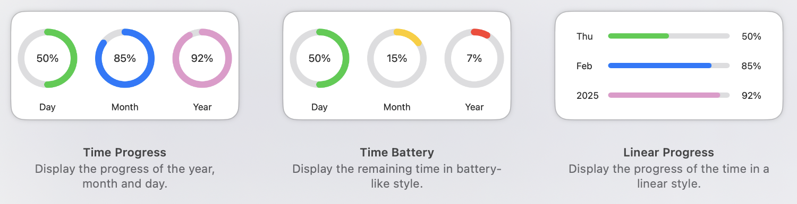

# TimeProgress

Track the progress of the year, month, and day right from your Home Screen!

## Features

- **Automatic Updates:** Widgets refresh every 15 minutes.
- **Multiple Sizes:** Supports **Small** and **Medium** widgets.
- **Dynamic Color Changes:** Widget colors change based on progress:
  - 🟢 **Green** for progress below 80%.
  - 🔵 **Blue** for progress between 80% and 90%. (Yellow for Battery-Style)
  - 💖 **Pink** for progress above 90%. (Red for Battery-Style)

## Screenshots

### Small-Size Widgets  

### Medium-Size Widgets  

## Installation & Usage

1. Download the `ZIP` file and extract it.
2. Move the `TimeProgress.app` file to your `Applications` folder.
3. Since this app is **not notarized by Apple**, macOS might prevent it from opening. To allow it:
   - Open **System Settings** → **Privacy & Security**.
   - Under **Security**, find the message about *TimeProgress.app* being blocked.
   - Click **Open Anyway**.
   - If prompted, confirm by clicking **Open** in the pop-up dialog.
4. Add your preferred widgets to your Home Screen.

## ⚠️⚠️⚠️ Disclaimer

This app is **not notarized by Apple**, meaning macOS may flag it as unverified software. Only install and run this app if you trust the source. Avoid executing unknown or unverified software unless you fully understand the risks. Always ensure your system's security and back up important data.

## 🙏 Acknowledgements

Special thanks to the icon creator, [@KAI](https://github.com/KAI-NEX), for his amazing design!

